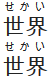
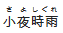
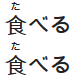
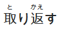

# markdown-ruby

## 项目介绍
> 本项目库基于[furigana-markdown](https://github.com/amclees/furigana-markdown)、[markdown-ruby](https://github.com/jiangwu10057/markdown-ruby)修改而来！
使 Docsify 文档可以使用简洁的注音标记。

## Markdown注音符号格式展示说明

#### Basic Furigana
By default, the following formats can be used.
```
[世界]^(せかい)
[世界]{せかい}
```
produces



#### Inline/Auto-matching Furigana
By default, inline matching can also be used. It only works above kanji however.
```
世界【せかい】
世界{せかい}
```
produces


#### Seperate Furigana for each Kanji
By default, furigana is displayed equally spaced above each kanji. Using any of the seperators `. ． 。 ・`, spacing can be specified (only in the inline format).
```
小夜時雨【さ・よ・しぐれ】
```
produces



#### Pattern Matching Furigana
Pattern matching, enabled by default, also allows the following formats,
in which the whole word can be added in kana to the furigana.
```
食べる【たべる】
食べる{たべる}
```
produces



By using the basic furigana format, compound words can be matched too.
```
[取り返す]{とりかえす}
```
produces



This makes it easier to get the kanji version of the word from an IME without backtracking through the text to place furigana.

## 使用
```
...
<script>
  window.$docsify = { ... };
</script>
<script src="//cdn.jsdelivr.net/npm/docsify@4"></script>
<script src="//cdn.jsdelivr.net/gh/ajtn123/docsify-ruby@latest/dist/MDRubyRender.min.js"></script>
...
```
